# Island Scholars Platform - Business Flow Diagrams

## Comprehensive Business Flow Visualization

### 1. High-Level System Architecture Flow

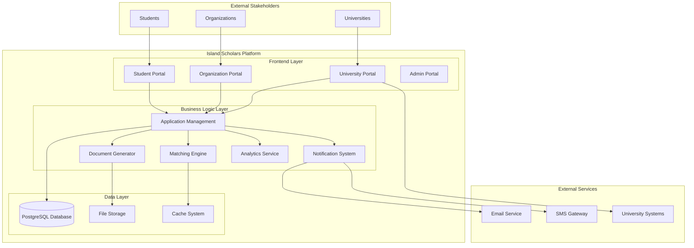

### 2. Student Journey Flow

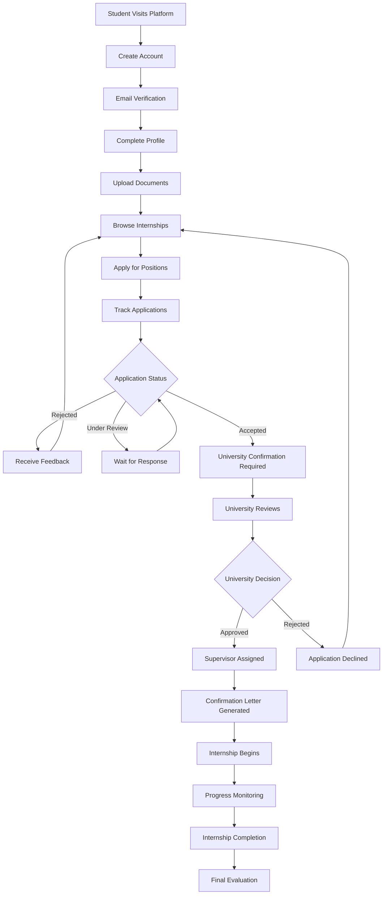

### 3. Organization Workflow

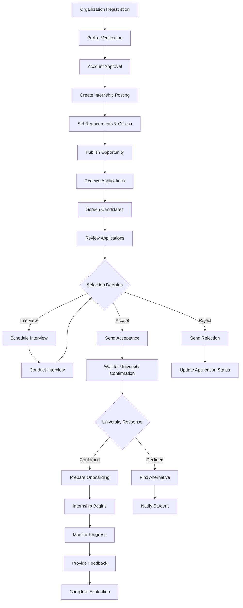

### 4. University Confirmation Process

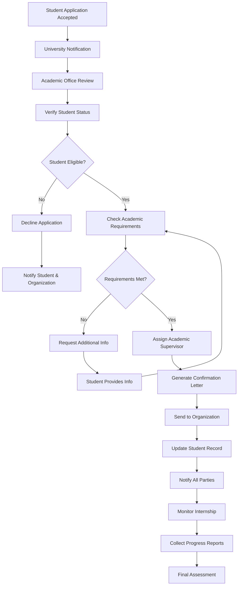

### 5. Application Lifecycle Management

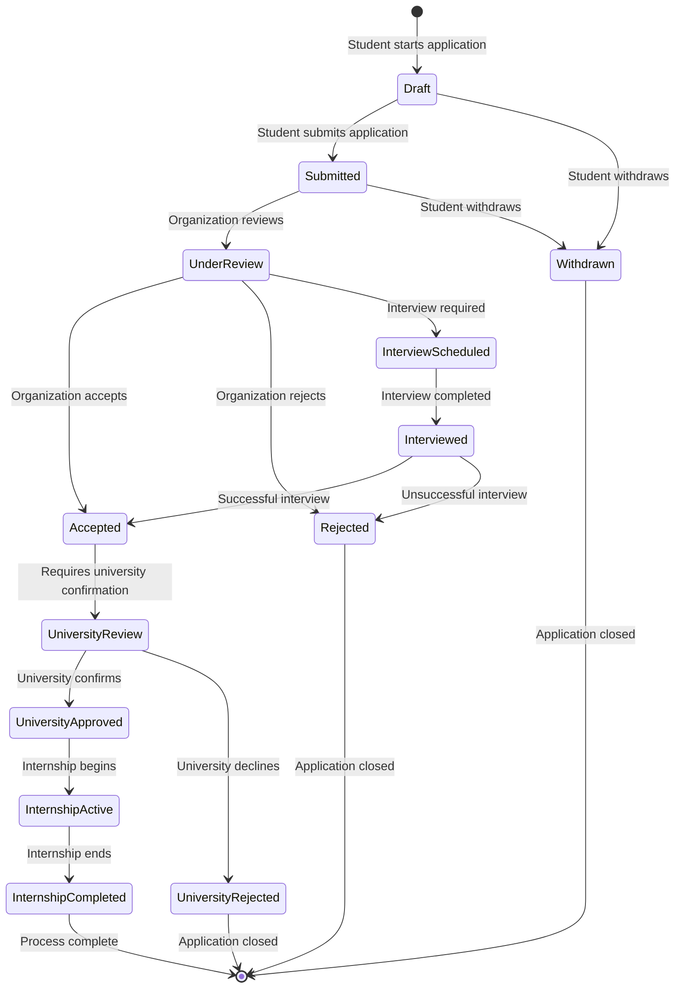

### 6. Data Flow Architecture

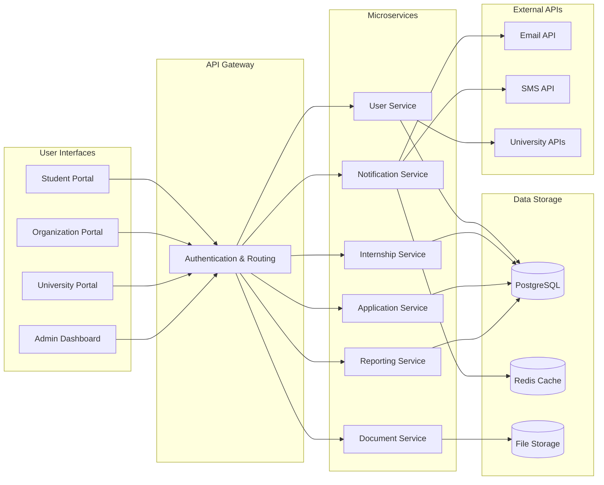

### 7. Security and Authentication Flow

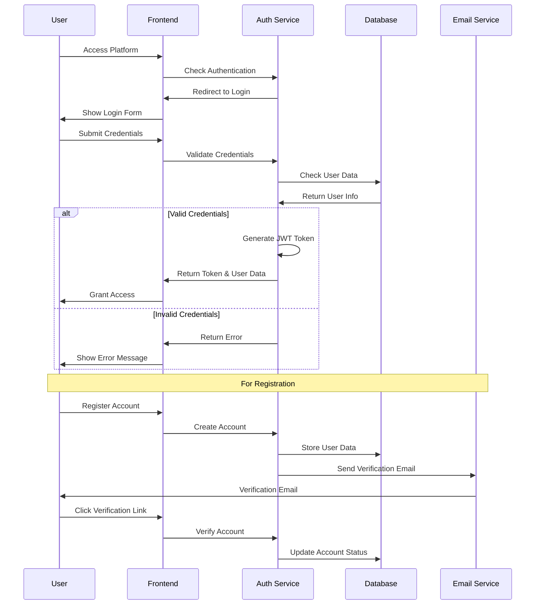

### 8. Notification System Flow

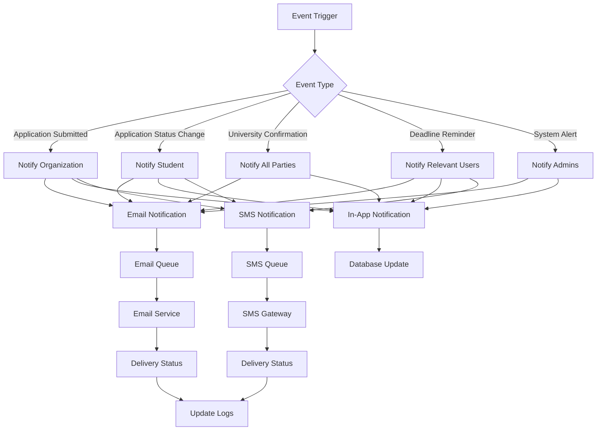

### 9. Document Management Flow

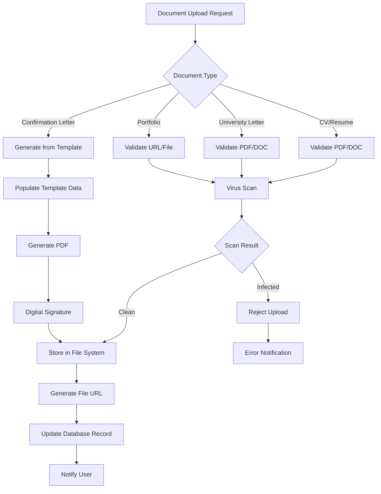

### 10. Analytics and Reporting Flow

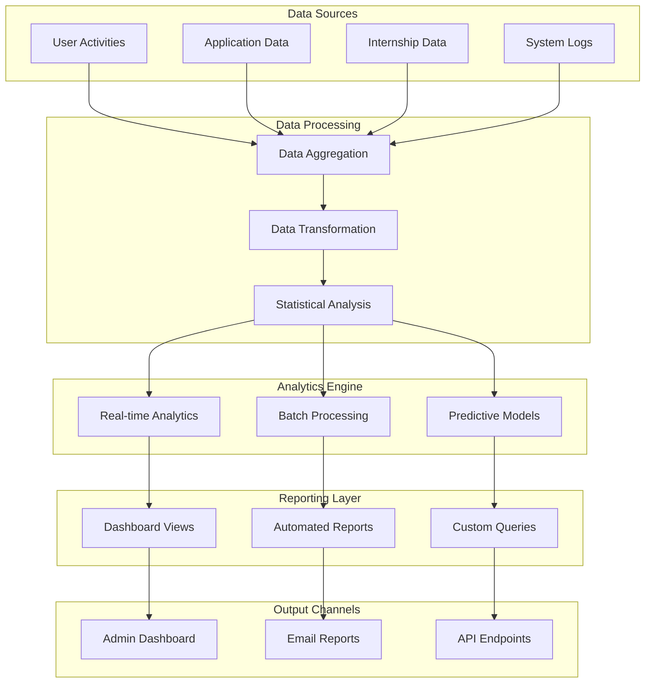

### 11. Integration Architecture

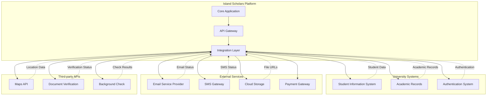

---

## Business Process Metrics Dashboard

### Key Performance Indicators (KPIs) Flow

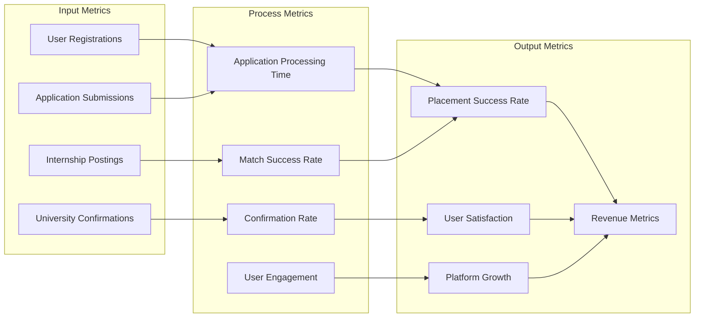

This comprehensive business flow documentation provides a complete understanding of how the Island Scholars platform operates, from user interactions to data processing and external integrations. Each diagram represents a critical aspect of the business logic that drives the platform's success in connecting students with internship opportunities across Tanzania.