# Unified Project Documentation Template
## Island Scholars Platform

---

## 1. Executive Summary

### Project Title
**Island Scholars Platform - Digital Internship Ecosystem for Tanzania**

### Purpose of the Document
This comprehensive documentation serves as the complete technical and business blueprint for the Island Scholars platform, providing stakeholders with detailed insights into system architecture, business processes, implementation strategy, and project deliverables. It establishes a single source of truth for all aspects of the project, ensuring alignment across development, business, and operational teams.

### Target Audience
- **Primary**: Development team, project managers, system architects who need detailed technical specifications and implementation guidelines
- **Secondary**: Business stakeholders, university partners, organization clients who require understanding of platform capabilities and business processes
- **Tertiary**: Quality assurance teams, deployment engineers, maintenance staff who need operational and support information

### Project Summary
Island Scholars is a comprehensive digital platform designed to revolutionize the internship ecosystem in Tanzania by connecting university students with organizations and streamlining the entire internship application, confirmation, and management process. The platform addresses critical gaps in the current manual system by providing a centralized marketplace for opportunities, automated workflows, and integrated university confirmation processes that benefit all stakeholders in the educational and professional ecosystem.

### Brief Problem
Tanzania's internship system faces significant challenges including fragmented processes, limited visibility of opportunities, manual documentation, poor communication between stakeholders, and geographic barriers that prevent optimal student-organization matching. These inefficiencies result in approximately 40% of students struggling to secure required internships, organizations unable to find qualified candidates, and universities burdened with excessive administrative overhead.

### Solution
A centralized digital platform that automates internship workflows, provides intelligent matching algorithms, enables seamless university confirmations, and offers comprehensive analytics for all stakeholders in the Tanzanian education and employment ecosystem. The solution transforms a paper-based, disconnected process into a streamlined digital experience that increases placement rates, reduces administrative burden, and creates better matches between student skills and organizational needs.

---

## 2. Introduction

### Background and Context
Tanzania's higher education landscape includes 40+ universities serving over 200,000 students, with 85% requiring mandatory internships for graduation. The traditional manual process creates bottlenecks, limits opportunities, and reduces the quality of student-organization matches. Currently, students spend an average of 3-4 weeks searching for opportunities, organizations struggle to find qualified candidates, and universities allocate significant resources to managing paper-based confirmation processes. The digital transformation of this ecosystem represents a significant opportunity to improve educational outcomes and workforce development in Tanzania.

### Problem Statement
The current internship ecosystem in Tanzania suffers from:
- **Fragmented Discovery**: Students struggle to find relevant opportunities, often limited to personal networks and physical notice boards, resulting in missed opportunities and suboptimal matches
- **Manual Processes**: Time-consuming application and confirmation procedures requiring physical document submission, in-person visits, and paper-based tracking
- **Limited Reach**: Geographic and network barriers restrict access to opportunities, particularly disadvantaging students from rural areas and smaller institutions
- **Poor Tracking**: Lack of visibility into application status and progress, creating uncertainty and inefficient follow-up processes
- **Quality Issues**: Suboptimal matching between student skills and organizational needs due to limited information and screening capabilities

### Justification for the Project
Digital transformation of the internship ecosystem will:
- Increase placement rates from 60% to 90%, ensuring more students complete required internships
- Reduce administrative overhead by 80%, freeing university and organization resources
- Expand opportunity access across all regions, promoting educational equity
- Improve match quality through AI-powered algorithms, enhancing student learning and organizational value
- Create data-driven insights for continuous improvement of the educational system
- Support Tanzania's digital transformation and workforce development goals
- Provide a scalable solution that can grow with the educational system

### General & Specific Objectives

**General Objective:**
Transform Tanzania's internship ecosystem through comprehensive digital platform integration, creating a seamless connection between educational institutions, students, and organizations to enhance practical learning experiences and workforce readiness.

**Specific Objectives:**
1. Develop a scalable web platform supporting 15,000+ concurrent users with responsive design for all devices
2. Implement intelligent matching algorithms with 85% satisfaction rate based on skills, location, and academic requirements
3. Integrate with 40+ universities for seamless confirmation processes, reducing administrative overhead by 80%
4. Onboard 500+ organizations across all major industries within 18 months of launch
5. Achieve 90% internship placement rate within 24 months, improving from the current 60% rate
6. Establish comprehensive analytics and reporting capabilities for data-driven decision making
7. Create a secure document management system for all internship-related documentation
8. Implement a multi-channel notification system to keep all stakeholders informed

### Scope of the System

**In Scope:**
- Student registration and profile management with academic verification
- Organization onboarding and internship posting with detailed opportunity specifications
- University integration and confirmation workflows including supervisor assignment
- Application management and tracking with status notifications
- Document generation and management for official letters and certificates
- Notification and communication systems across multiple channels
- Analytics and reporting dashboards for all stakeholder types
- Mobile-responsive web application optimized for Tanzanian internet conditions
- Role-based access control and security features
- Multi-language support (English and Swahili)

**Out of Scope:**
- Payroll management for internships or financial transactions
- Academic grading systems integration with university ERP systems
- Social media platform development beyond basic sharing functionality
- Video conferencing capabilities for interviews or meetings
- Third-party job board integrations with external recruitment platforms
- Physical verification of student documents or qualifications
- Internship curriculum development or learning management
- Post-internship employment tracking or career services

### Stakeholders

| Stakeholder | Role | Responsibilities |
|-------------|------|------------------|
| **Students** | Primary Users | Profile creation, application submission, document management, internship completion |
| **Organizations** | Service Providers | Opportunity posting, candidate review, selection decisions, internship supervision |
| **Universities** | Validators | Student confirmation, supervisor assignment, progress monitoring, academic evaluation |
| **System Administrators** | Platform Managers | User management, system monitoring, data analytics, content moderation |
| **Development Team** | Builders | Platform development, maintenance, feature enhancement, technical support |
| **Project Sponsors** | Decision Makers | Strategic direction, resource allocation, success metrics, stakeholder management |
| **Government Agencies** | Regulators | Educational standards, labor regulations, data protection compliance |
| **Industry Associations** | Advisors | Industry requirements, quality standards, partnership development |

---

## 3. Business Process Overview

### Current Business Workflow

**Traditional Process Flow:**

The current internship process in Tanzania is predominantly manual, fragmented, and inefficient. Students typically begin by searching for opportunities through university notice boards, personal networks, and direct company inquiries. This discovery phase is limited by geographic and information barriers, with students in major cities having significant advantages over those in rural areas.

The application process involves preparing physical documents, often traveling to submit applications in person, and waiting for responses without visibility into the review process. Organizations manually screen applications, conduct interviews, and make selections without standardized evaluation criteria or efficient candidate comparison tools.

Once selected, students must navigate a complex university confirmation process involving multiple departments, paper forms, and official stamps. This process can take weeks, delaying internship starts and creating uncertainty for all parties. Throughout the internship, progress tracking and evaluation remain manual, with limited standardization or digital record-keeping.


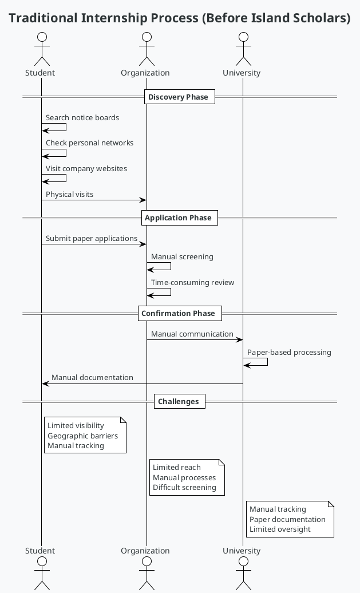

### Identified Gaps / Challenges

**System-wide Challenges Diagram:**

The current internship system in Tanzania faces multiple interconnected challenges that affect all stakeholders. Students struggle with limited visibility into opportunities, geographic barriers to access, complex application processes, and poor tracking mechanisms. Many students, particularly those from rural areas or smaller institutions, face significant disadvantages in securing quality internships.

Organizations face challenges in talent discovery, application management, quality assessment of candidates, communication gaps with universities, and administrative burdens. This results in suboptimal candidate selection, inefficient processes, and missed opportunities to engage with promising talent.

Universities struggle with student tracking, industry connections, documentation management, supervisor assignment, and progress monitoring. The manual nature of these processes creates administrative bottlenecks, data inconsistencies, and limited oversight of student internship experiences.

These stakeholder-specific challenges contribute to system-wide issues including fragmented processes, information asymmetry, quality control problems, scalability limitations, and data silos. The lack of standardization and digital integration creates inefficiencies that impact educational outcomes and workforce development.


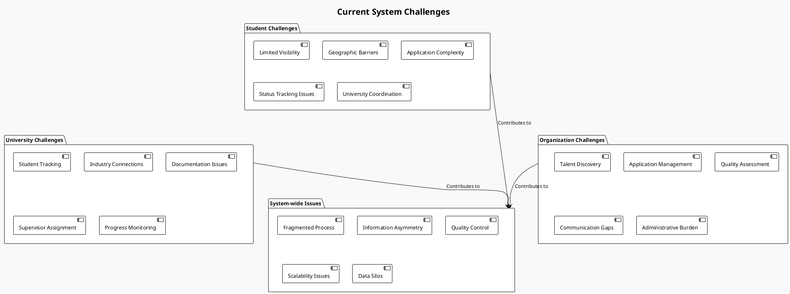

### Proposed Improvements

**Digital Transformation Solution:**

The Island Scholars platform proposes a comprehensive digital transformation of the internship ecosystem through a centralized platform that connects all stakeholders and automates key workflows. The solution architecture consists of four interconnected layers that work together to create a seamless experience.

The Digital Platform Solution layer provides the foundation with a centralized ecosystem, real-time communication capabilities, automated workflows, document management, and mobile responsiveness. This ensures accessibility and connectivity for all stakeholders regardless of location or device.

The Enhanced User Experience layer builds on this foundation with personalized recommendations for students, one-click application submissions, real-time status tracking, digital portfolios, and seamless university integration. These features dramatically improve usability and engagement.

The Process Automation layer implements smart matching algorithms, automated notifications, document generation, compliance checking, and status updates. This reduces manual work, eliminates errors, and accelerates processes that previously took days or weeks.

The Data-Driven Insights layer provides analytics dashboards, success metrics, trend analysis, performance tracking, and predictive models. These insights enable continuous improvement and strategic decision-making for all stakeholders.


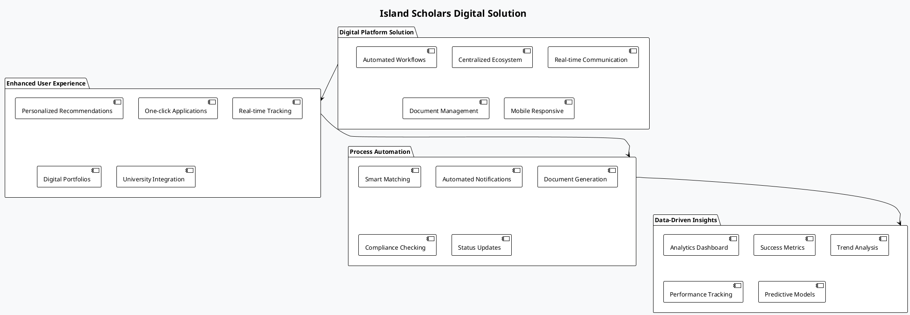

### Business Goals and KPIs

**Success Metrics Framework:**

The Island Scholars platform has established a comprehensive framework of business goals and key performance indicators (KPIs) to measure success and guide development priorities. The framework consists of primary goals that are measured through specific metrics across four key dimensions.

The Primary Goals include achieving a 90% student placement rate, onboarding 500+ organizations, improving process efficiency by 80%, and maintaining an 85% satisfaction rate across all stakeholders. These ambitious targets represent transformative improvement over the current state.

These goals are measured through User Engagement metrics that track platform adoption and usage patterns, Business Process metrics that evaluate operational efficiency and effectiveness, Quality Metrics that assess stakeholder satisfaction and outcomes, and Growth Metrics that monitor expansion and scaling of the platform.

Each metric has specific targets, measurement methodologies, and reporting frequencies to ensure consistent tracking and evaluation. This comprehensive approach to performance measurement ensures that the platform delivers tangible value to all stakeholders and achieves its transformative potential.


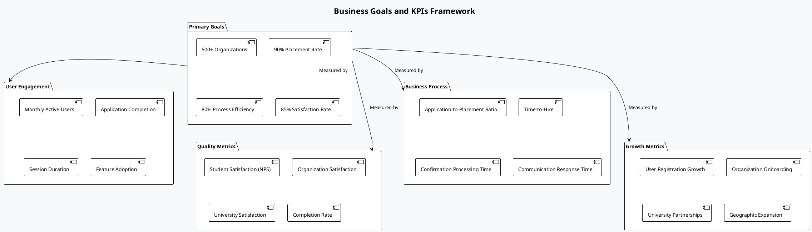

### Process Flow Diagram

**End-to-End Business Process:**

The Island Scholars platform implements a streamlined end-to-end business process that connects students, organizations, and universities in a seamless workflow. The process begins with student registration and profile creation, including document uploads that verify their academic status and qualifications.

Students can then browse opportunities and submit applications to positions matching their skills and interests. Organizations post internship opportunities and review incoming applications, making selection decisions based on comprehensive student profiles and application materials.

When an organization accepts an application, the university is automatically notified to review and confirm the student's eligibility. The university verifies the student's status, assigns an academic supervisor, and generates an official confirmation letter if approved. This digital confirmation process replaces the previous paper-based system, reducing processing time from weeks to days.

If the application is rejected by either the organization or university, the student is notified and can apply to other positions. If confirmed, the student begins the internship with all necessary documentation in place, and the platform continues to support progress monitoring and evaluation throughout the internship period.

This integrated process ensures transparency, efficiency, and accountability for all stakeholders, with automated notifications at each stage keeping everyone informed of status changes and required actions.


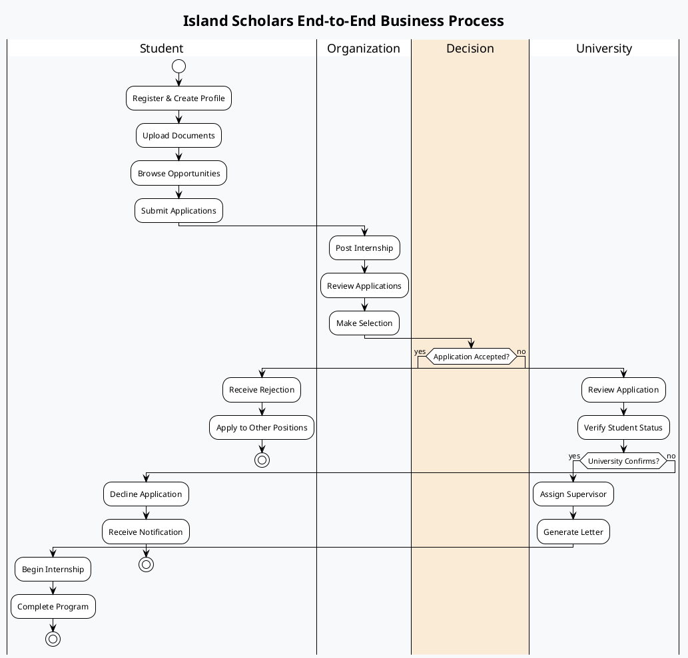

---

## 4. Requirements Specification (SRS)

### a. Functional Requirements

**Core System Functions:**

The Island Scholars platform is built around six core functional modules that work together to create a comprehensive internship management ecosystem. Each module addresses specific stakeholder needs and process requirements.

The User Management module handles all aspects of user accounts, including multi-role registration, profile management, authentication with JWT tokens, and role-based access control. This module ensures secure access and appropriate permissions for each user type.

The Application Management module enables students to submit applications, track status, upload documents, and for organizations to review and process applications. This module is the core workflow engine of the platform.

The Internship Management module allows organizations to post opportunities, students to search and filter listings, the system to match students with relevant positions, and manage application deadlines. This module creates the marketplace for internship opportunities.

The University Integration module facilitates the confirmation workflow, supervisor assignment, document generation, and progress monitoring. This module digitizes previously manual university processes.

The Communication module provides notifications, email integration, SMS alerts, and in-app messaging to keep all stakeholders informed and connected. This module ensures timely information flow.

The Analytics & Reporting module offers dashboard views, statistical reports, performance metrics, and data export capabilities. This module enables data-driven decision making and continuous improvement.


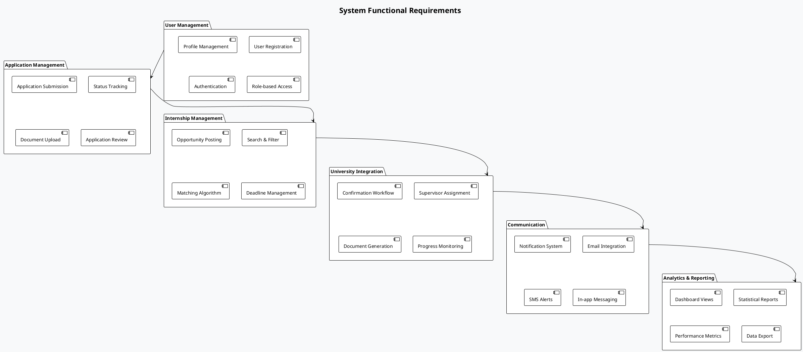

**Detailed Functional Requirements:**

1. **User Registration & Authentication**
   - Multi-role registration (Student, Organization, University) with role-specific information collection
   - Email verification and password reset functionality with secure token generation
   - Secure login with JWT tokens including refresh token mechanism
   - Profile completion workflows with progress tracking and guidance
   - Account verification processes for organizations and universities
   - Social authentication options (optional for future phases)

2. **Student Functions**
   - Profile creation with academic information, skills, and preferences
   - Document upload (CV, university letters) with format validation
   - Internship search and filtering by location, industry, duration, etc.
   - Application submission and tracking with status notifications
   - University confirmation status monitoring and documentation
   - Skill assessment and recommendation engine
   - Internship history and performance tracking

3. **Organization Functions**
   - Company profile setup with verification process
   - Internship opportunity posting with detailed requirements
   - Application review and management with filtering and sorting
   - Candidate communication through in-platform messaging
   - Selection and rejection workflows with automated notifications
   - Internship management dashboard with status tracking
   - Analytics on application trends and candidate demographics

4. **University Functions**
   - Student verification and confirmation with digital approval process
   - Academic supervisor assignment from university faculty database
   - Official document generation with university letterhead and signatures
   - Progress monitoring and evaluation of student internships
   - Reporting on student placement statistics and outcomes
   - Integration with university academic requirements
   - Batch processing for multiple student confirmations

5. **System Administration**
   - User management and verification with manual override capabilities
   - Platform monitoring and analytics with performance dashboards
   - Content moderation for internship listings and user profiles
   - System configuration including email templates and notification settings
   - Access control and permission management
   - Audit logging and security monitoring
   - Data backup and restoration procedures

### b. Non-functional Requirements

**Performance Requirements:**
- Response time: < 2 seconds for all user interactions, even under peak load conditions
- Throughput: Support 1,000 concurrent users during application season peaks
- Availability: 99.9% uptime (8.76 hours downtime/year) with planned maintenance windows
- Scalability: Handle 15,000+ registered users with linear performance scaling
- Page load time: < 3 seconds for initial load, < 1 second for subsequent interactions
- Database query performance: < 500ms for complex queries, < 100ms for simple queries
- File upload/download: Support files up to 10MB with optimized transfer speeds

**Security Requirements:**
- Data encryption in transit (TLS 1.3) and at rest (AES-256)
- GDPR compliance for data protection with consent management
- Regular security audits and penetration testing (quarterly)
- Secure file upload with virus scanning and content validation
- Role-based access control with principle of least privilege
- Password policies enforcing strong credentials
- Brute force protection with account lockout mechanisms
- Audit logging for security-relevant events
- Secure session management with appropriate timeouts

**Usability Requirements:**
- Mobile-responsive design for all devices (phones, tablets, desktops)
- Intuitive user interface with minimal learning curve (< 30 minutes for basic tasks)
- Accessibility compliance (WCAG 2.1 AA) for users with disabilities
- Multi-language support (English, Swahili) with easy language switching
- Consistent navigation and interaction patterns across the platform
- Helpful error messages and recovery options
- Progressive enhancement for varying connection speeds
- Offline capabilities for essential functions
- Context-sensitive help and tooltips

**Reliability Requirements:**
- Automated backup systems with daily incremental and weekly full backups
- Disaster recovery procedures with < 4 hour recovery time objective
- Error handling and graceful degradation during partial system failures
- Data integrity validation with checksums and validation rules
- Fault tolerance for external service dependencies
- Automated monitoring and alerting for system issues
- Redundancy for critical system components
- Comprehensive logging for troubleshooting and auditing

### c. Security Requirements

**Security Architecture:**

The Island Scholars platform implements a comprehensive security architecture that protects user data, system integrity, and service availability through multiple layers of security controls. This defense-in-depth approach ensures that security is maintained even if individual controls are compromised.

The Frontend Security layer implements HTTPS encryption for all communications, input validation to prevent injection attacks, XSS protection through content security policies and output encoding, and CSRF protection with anti-forgery tokens. These controls protect the user interface from common web vulnerabilities.

The API Security layer implements JWT authentication with proper signature validation, rate limiting to prevent abuse, an API gateway for centralized security enforcement, and request validation to ensure data integrity. These controls protect the communication channel between frontend and backend.

The Backend Security layer implements role-based access control for proper authorization, data encryption for sensitive information, comprehensive audit logging of security events, and secure session management. These controls protect the application logic and business rules.

The Database Security layer implements encrypted storage for sensitive data, granular access controls based on user roles, encrypted backups to prevent data theft, and query sanitization to prevent SQL injection. These controls protect the data at rest.

The Infrastructure Security layer implements firewall protection with restrictive rules, DDoS mitigation through rate limiting and traffic analysis, continuous security monitoring for suspicious activities, and regular vulnerability scanning to identify weaknesses. These controls protect the underlying infrastructure.


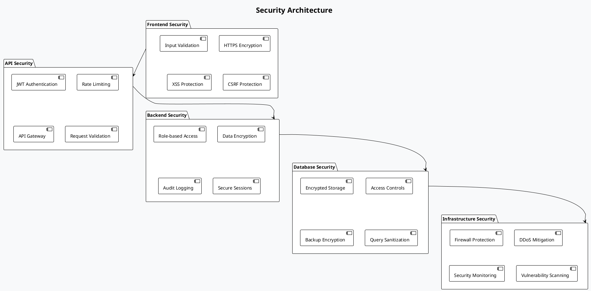

### d. Assumptions & Constraints

**Project Assumptions:**
- Universities will cooperate with digital integration and adopt the platform for student confirmations
- Organizations will see value in the platform and adopt it for internship recruitment
- Students have access to internet and devices capable of accessing the platform
- Government regulations regarding internships and student data will remain stable
- Technical infrastructure (internet connectivity, hosting services) is available and reliable
- Stakeholders will provide timely feedback during development and testing
- The platform can achieve critical mass of users within the projected timeline
- English and Swahili language support will be sufficient for the target audience
- Mobile access will be the primary mode for many users, especially students

**Project Constraints:**
- Budget limitations for development and infrastructure, requiring phased implementation
- Timeline constraints for market entry to align with academic calendars
- Technical limitations of existing university systems for integration
- Regulatory compliance requirements for educational data and privacy
- Resource availability for ongoing maintenance and support
- Internet connectivity challenges in some regions of Tanzania
- Varying technical literacy among user groups
- Limited availability of local development talent with required skills
- Cultural and organizational resistance to digital transformation
- Competing priorities from stakeholder organizations

---

## 5. Development Methodology

### Chosen Model: Agile with DevOps Integration

**Development Methodology Overview:**

The Island Scholars platform will be developed using an Agile methodology enhanced with DevOps practices to ensure rapid, iterative delivery of value while maintaining high quality and operational excellence. This hybrid approach combines the flexibility and user-focus of Agile with the automation and reliability of DevOps.

The Agile Framework provides the foundation with structured sprint planning to define work increments, daily standups for team coordination, sprint reviews to demonstrate completed work to stakeholders, and retrospectives for continuous process improvement. This iterative approach ensures regular feedback and adaptation.

DevOps Practices enhance the development process with continuous integration to automatically build and test code changes, continuous deployment to reliably deliver updates to production, infrastructure as code to manage environments consistently, and comprehensive monitoring and logging for operational visibility. These practices automate repetitive tasks and reduce deployment risks.

Quality Assurance is integrated throughout with automated testing at multiple levels, code reviews to maintain quality standards, security scanning to identify vulnerabilities early, and performance testing to ensure the platform meets non-functional requirements. This shift-left approach to quality prevents defects rather than finding them later.

Collaboration Tools support the entire process with version control for code management, project management tools for tracking work, communication platforms for team coordination, and comprehensive documentation for knowledge sharing. These tools enable effective teamwork across distributed teams.


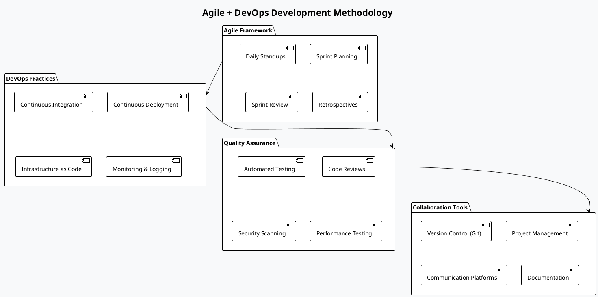

### Why This Method

**Agile + DevOps Benefits:**
- Rapid iteration and feedback cycles that align development with user needs
- Continuous delivery of value through incremental feature releases
- Early risk identification and mitigation through regular demonstrations
- Improved collaboration between development, operations, and business teams
- Automated quality assurance that maintains high standards while enabling speed
- Scalable and maintainable codebase through consistent practices and automation
- Flexibility to adapt to changing requirements and market conditions
- Transparency for all stakeholders through visible progress and metrics
- Reduced time-to-market for critical features and improvements
- Sustainable development pace that prevents burnout and technical debt

This methodology is particularly well-suited for the Island Scholars platform because:
1. The multi-stakeholder nature requires frequent feedback and adaptation
2. The phased rollout strategy aligns with iterative development
3. The need for high reliability and security demands automated testing and deployment
4. The evolving requirements benefit from flexible planning and execution
5. The distributed team structure requires strong collaboration tools and practices

### Roles and Responsibilities

**Team Structure:**

The Island Scholars development team is structured to ensure clear accountability, effective collaboration, and comprehensive coverage of all required skills and responsibilities. The team is organized into four main groups, each with specific roles and responsibilities.

The Leadership group includes the Product Owner who represents stakeholder interests and prioritizes the product backlog, the Scrum Master who facilitates the Agile process and removes impediments, and the Technical Lead who provides architectural guidance and technical direction. This group ensures alignment between business goals and technical implementation.

The Development group includes Frontend Developers who create the user interfaces and client-side functionality, Backend Developers who implement the API and business logic, and Full-stack Developers who work across the entire application stack. This group builds the core platform functionality.

The Quality & Operations group includes QA Engineers who design and execute test strategies, DevOps Engineers who manage infrastructure and deployment pipelines, and Security Specialists who ensure the platform meets security requirements. This group ensures the platform is reliable, secure, and maintainable.

The Design & UX group includes UI/UX Designers who create user-centered interfaces, Business Analysts who translate business needs into requirements, and Technical Writers who create documentation for users and developers. This group ensures the platform is usable, meets business needs, and is well-documented.


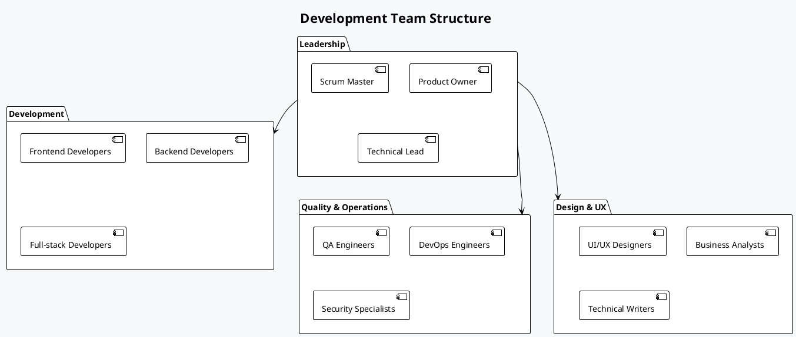

### Iteration Plan or Timeline

**Project Timeline:**

The Island Scholars platform will be developed and deployed over a 12-month period, divided into four distinct phases that build upon each other to deliver a complete, robust solution. Each phase has specific goals, deliverables, and milestones to ensure steady progress and value creation.

The Foundation Phase (January-March 2024) focuses on establishing the core platform infrastructure, implementing basic user management, creating essential UI components, and setting up the development pipeline. This phase delivers a Minimum Viable Product (MVP) with basic functionality for all user types.

The Enhancement Phase (April-June 2024) builds on the foundation by adding advanced matching algorithms, university integration features, document management capabilities, and enhanced notification systems. This phase significantly improves the user experience and workflow automation.

The Optimization Phase (July-September 2024) focuses on analytics and reporting, performance improvements, security hardening, and mobile optimization. This phase ensures the platform is robust, secure, and performs well under load.

The Scale Phase (October-December 2024) prepares the platform for growth with multi-language support, advanced integrations, geographic expansion features, and partnership capabilities. This phase positions the platform for long-term success and market leadership.


```plantuml
@startuml Project Timeline
!theme plain
skinparam backgroundColor #f8f9fa

title Project Implementation Timeline

project starts 2024-01-01

[Foundation Phase] starts 2024-01-01 and ends 2024-03-31
[Enhancement Phase] starts 2024-04-01 and ends 2024-06-30
[Optimization Phase] starts 2024-07-01 and ends 2024-09-30
[Scale Phase] starts 2024-10-01 and ends 2024-12-31

[Foundation Phase] is colored in LightBlue
[Enhancement Phase] is colored in LightGreen
[Optimization Phase] is colored in LightYellow
[Scale Phase] is colored in LightPink

@enduml
```

---

## 6. System Architecture (SDD)

### Logical Architecture

**High-Level System Architecture:**

The Island Scholars platform employs a layered architecture that separates concerns, enables scalability, and facilitates maintenance. This architecture consists of five distinct layers, each with specific responsibilities and interfaces to adjacent layers.

The Presentation Layer contains the user interfaces for different stakeholder types: Student Portal for internship discovery and application, Organization Portal for opportunity posting and candidate management, University Portal for confirmation and supervisor assignment, and Admin Dashboard for system management. These interfaces are responsive, accessible, and optimized for their specific user types.

The API Gateway serves as the entry point for all client requests, handling authentication to verify user identity, rate limiting to prevent abuse, request routing to appropriate services, and response caching to improve performance. This centralized gateway enforces security policies and provides a consistent interface for clients.

The Business Logic Layer contains the core services that implement the platform's functionality: User Management Service for account and profile operations, Application Service for internship applications, Internship Service for opportunity management, Notification Service for alerts and messages, Document Service for file generation and storage, and Analytics Service for reporting and insights. These services encapsulate the business rules and workflow logic.

The Data Access Layer abstracts the interaction with data storage systems through Database Abstraction for SQL operations, File Storage Interface for document management, Cache Management for performance optimization, and External API Integration for third-party services. This abstraction allows the business logic to remain independent of specific storage technologies.

The Infrastructure Layer provides the physical storage and processing capabilities through PostgreSQL Database for structured data, Redis Cache for high-speed data access, File Storage for documents and images, and Message Queue for asynchronous processing. These components are deployed and scaled independently to meet performance requirements.


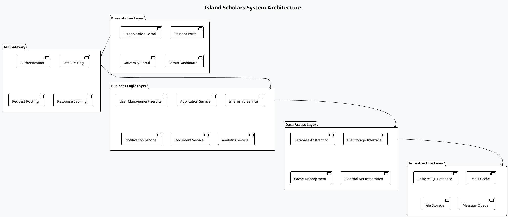

### Technology Stack

**Technology Stack Overview:**

The Island Scholars platform utilizes a modern, robust technology stack that balances performance, developer productivity, and maintainability. The stack is divided into four main categories, each serving specific aspects of the system.

The Frontend stack is built around React 18, a powerful and flexible JavaScript library for building user interfaces. Bootstrap 5 provides responsive design components and styling, while Framer Motion adds sophisticated animations and transitions. React Router handles navigation and routing between different views. This combination enables rapid development of responsive, interactive user interfaces with excellent performance characteristics.

The Backend stack is centered on Django 4.2, a high-level Python web framework that encourages rapid development and clean, pragmatic design. Django REST Framework extends Django with powerful tools for building Web APIs, while PostgreSQL provides a robust, feature-rich relational database. Redis adds high-performance caching and message brokering capabilities. This stack offers excellent security, scalability, and developer productivity.

The DevOps & Infrastructure stack includes Docker for containerization, GitHub Actions for continuous integration and deployment, AWS/DigitalOcean for cloud hosting, and Nginx for web serving and load balancing. These tools enable consistent deployment, scalable infrastructure, and reliable operations.

The External Services category includes integrations with third-party services for Email delivery, SMS messaging, File Storage, and Monitoring. These services extend the platform's capabilities without requiring custom implementation of commodity functionality.


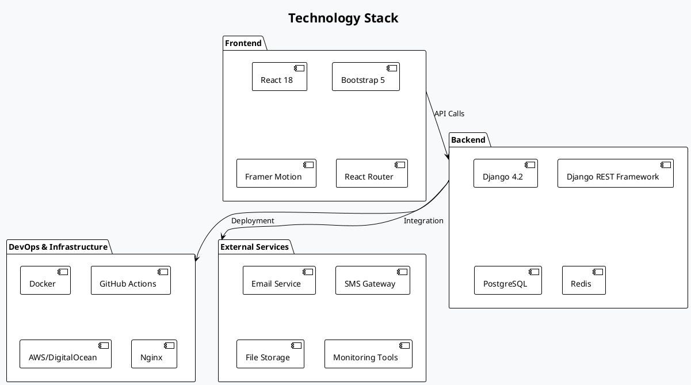

### Deployment Architecture Diagram

**Deployment Architecture:**

The Island Scholars platform employs a scalable, resilient deployment architecture designed to handle varying loads, provide high availability, and maintain performance under stress. This architecture distributes components across multiple servers and services to eliminate single points of failure.

The Load Balancer (Nginx) serves as the entry point for all user traffic, distributing requests across multiple web servers to balance load and provide failover capability. This component also terminates SSL connections and can perform basic request filtering.

The Web Servers host multiple instances of the Frontend App, serving the React-based user interface to clients. These stateless servers can be scaled horizontally as user load increases, with the load balancer automatically distributing traffic.

The API Servers host multiple instances of the Django API, processing business logic and data access requests. These servers handle authentication, authorization, and all application functionality. Like the web servers, they can be scaled horizontally to handle increased load.

The Database Cluster consists of a PostgreSQL Primary database for write operations and PostgreSQL Replicas for read operations. This configuration improves performance by distributing read queries and provides failover capability if the primary database experiences issues.

The Cache Layer uses Redis Cluster to store frequently accessed data, session information, and message queues. This distributed caching system reduces database load and improves response times for common operations.

The File Storage system uses AWS S3 or DigitalOcean Spaces to store user-uploaded documents, generated PDFs, and other binary data. This cloud storage solution provides high durability, availability, and scalability for file assets.

External Services include Email Service for sending notifications, SMS Gateway for mobile alerts, and Monitoring tools for system health tracking. These third-party services extend the platform's capabilities without requiring custom implementation.


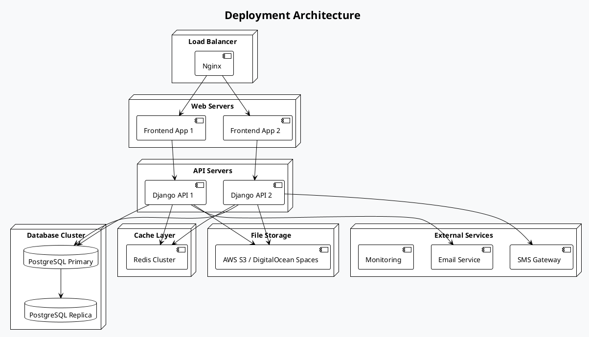

### System Components Overview

**Component Interaction Diagram:**

The Island Scholars platform consists of multiple components that interact to provide a complete internship management solution. These components communicate through well-defined interfaces to maintain separation of concerns while enabling comprehensive functionality.

The User Interface component provides the visual interface for all user interactions, handling form submissions, data display, and user navigation. It communicates with the Authentication Service for login/registration and with the Application Manager for submitting and tracking applications.

The Authentication Service manages user identity, handling login requests from the UI, verifying credentials against the Database, and issuing authentication tokens. This service implements security best practices for password management and session control.

The Application Manager is the core workflow engine, receiving application submissions from the UI, storing data in the Database, triggering notifications via the Notification Engine, and requesting document generation from the Document Generator. This component implements the business rules for application processing.

The Notification Engine handles all communication, receiving trigger events from the Application Manager, sending emails through the Email Service, and sending SMS messages through the SMS Gateway. This component ensures timely communication with all stakeholders.

The Document Generator creates official documents, receiving requests from the Application Manager, generating PDFs and other formats, applying digital signatures when required, and storing the results in the File Storage system. This component replaces manual document creation.

The Analytics Engine provides insights and reporting, querying data from the Database, performing statistical analysis, and sending results to the UI for display. This component enables data-driven decision making for all stakeholders.

These components work together to create a seamless, efficient platform that transforms the internship management process from a manual, paper-based system to a digital, automated workflow.


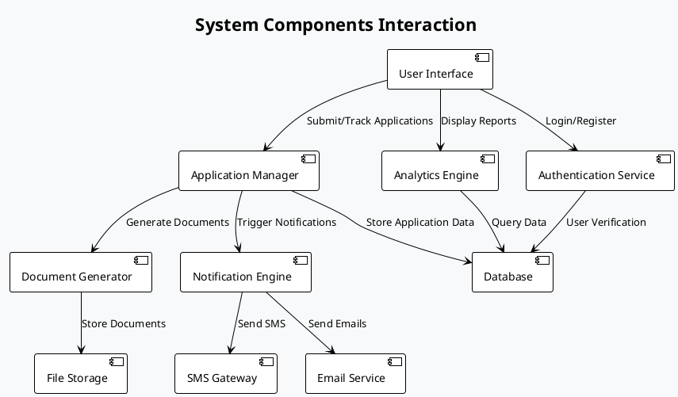

---

## 7. System Design Details

### a. Conceptual Design

**System Conceptual Model:**

The Island Scholars platform's conceptual design defines the core entities and their relationships, providing a high-level view of the system's structure independent of implementation details. This model is organized into two main packages: Core Entities and Business Objects.

The Core Entities package contains the fundamental user types and their profiles. The User entity serves as the base for authentication and common attributes, with specialized entities for each user role. The Student entity extends User with academic information like university, field of study, year of study, and skills. The Organization entity includes company details such as name, industry, description, and website. The University entity contains institutional information including name, location, academic programs, and supervisors.

The Business Objects package contains the entities that implement the internship process. The Internship entity represents an opportunity posted by an organization, including title, description, requirements, duration, location, and application deadline. The Application entity connects a student with an internship, tracking status, cover letter, resume, and timestamps. The Confirmation entity represents university approval of an internship, including supervisor assignment, dates, and academic requirements.

These entities and their relationships form the foundation of the system's data model and business logic. The conceptual design ensures that all stakeholder needs are represented in the system structure and that the relationships between entities accurately reflect the real-world internship process.


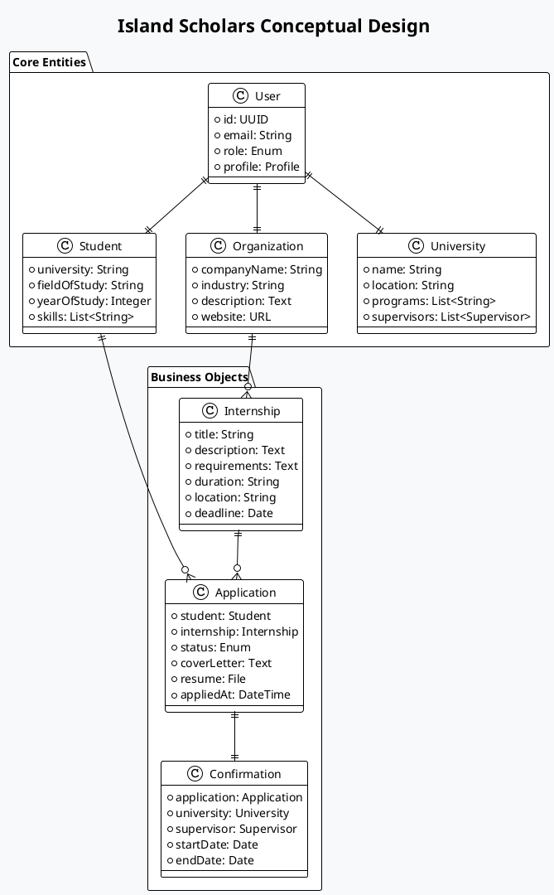

### b. Database Design

**Entity Relationship Diagram:**

The Island Scholars database design translates the conceptual model into a detailed relational schema optimized for data integrity, query performance, and scalability. The schema uses PostgreSQL's advanced features including UUID primary keys, JSON/JSONB for flexible data structures, and appropriate constraints to enforce business rules.

The users table serves as the central entity for authentication and common user attributes, with a role field determining the user type. Email and username fields have unique constraints to prevent duplicates, while timestamps track account creation and updates. This table implements the base User entity from the conceptual model.

The student_profiles and organization_profiles tables extend the users table with role-specific attributes, implementing a one-to-one relationship through the user_id foreign key. The student_profiles table stores academic information, skills as a JSONB array for flexible querying, and document references. The organization_profiles table stores company details, industry classification, and business information.

The internships table implements the Internship entity, with a foreign key to the organization that posted it. It includes comprehensive details about the opportunity, with skills_required stored as a JSONB array for flexible matching. The is_active flag enables temporary deactivation without deletion.

The applications table implements the Application entity, connecting students with internships through foreign keys. It tracks the application status, documents, and timestamps for the entire application lifecycle. The unique constraint on student_id and internship_id prevents duplicate applications.

The university_confirmations table implements the Confirmation entity, extending applications with university approval details. It includes foreign keys to the application, university, and supervisor, along with academic requirements and confirmation metadata.

This database design balances normalization for data integrity with denormalization for query performance, using PostgreSQL's advanced features to implement complex business rules efficiently.


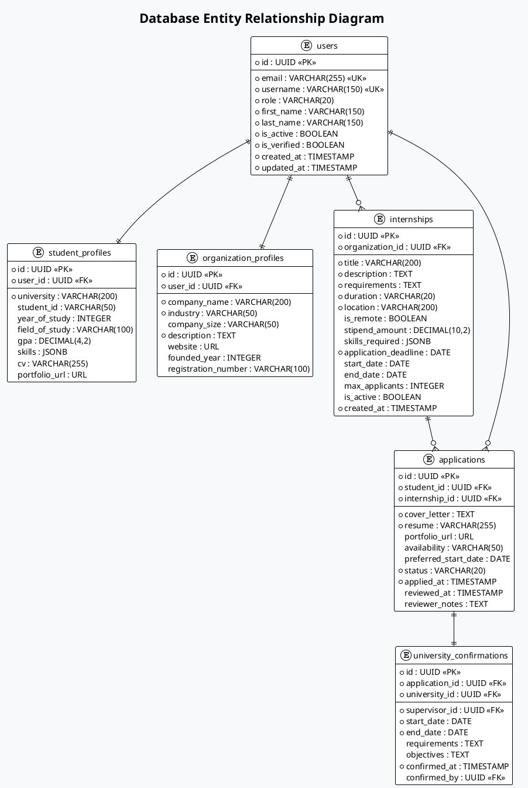

### c. User Interface Prototypes

**UI Component Architecture:**

The Island Scholars platform employs a component-based UI architecture that promotes reusability, maintainability, and consistency across the application. This architecture is organized into four layers of increasing specificity, from general-purpose components to specialized feature implementations.

The Layout Components layer provides the structural framework for all pages, including the Header with navigation and user controls, the Navigation system for moving between sections, the Footer with site information and links, and the Sidebar for contextual navigation. These components maintain consistent positioning and behavior throughout the application.

The Page Components layer implements specific views for major functional areas, including the Dashboard for user-specific overviews, Profile for user information management, Applications for tracking and managing internship applications, and Internships for browsing and posting opportunities. These components compose layout and feature components to create complete user experiences.

The Feature Components layer provides reusable implementations of specific functionality, including Search Filter for finding internships and organizations, Application Form for submitting applications, Status Tracker for monitoring progress, and Document Uploader for managing files. These components encapsulate complex behaviors that may be used across multiple pages.

The UI Elements layer contains the fundamental building blocks of the interface, including Buttons for user actions, Forms for data input, Cards for content display, Modals for focused interactions, and Tables for data presentation. These components implement the design system and ensure visual consistency.

This layered architecture enables efficient development through component reuse, maintains consistency through shared elements, and simplifies maintenance by isolating changes to specific components. The component hierarchy also facilitates responsive design by allowing components to adapt to different screen sizes and devices.


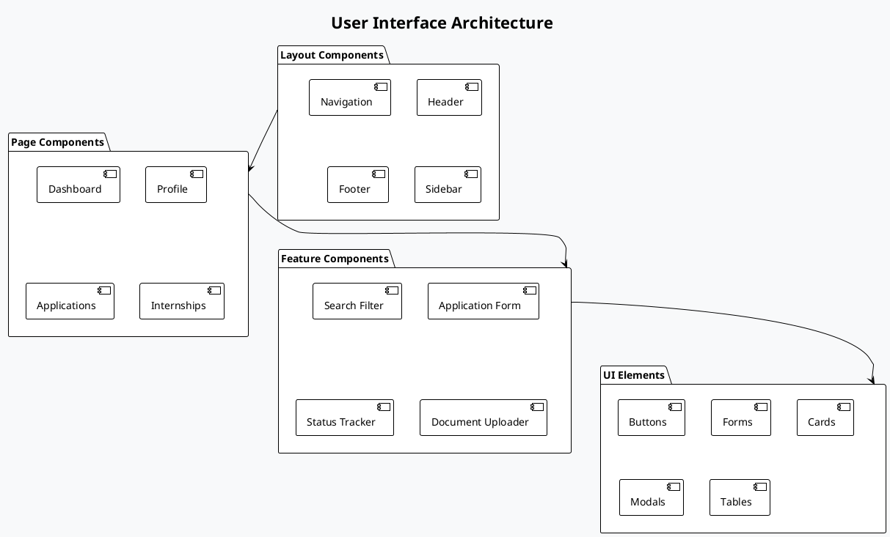

### d. Activity Diagrams

**Student Application Activity:**

The student application process is a core workflow in the Island Scholars platform, involving multiple actors and decision points. This activity diagram illustrates the complete process from initial login to internship completion.

The process begins with the student logging into the platform, browsing available internships, selecting an opportunity of interest, filling out the application form with required information, uploading supporting documents such as resume and cover letter, and submitting the application. These steps are performed in the Student swimlane.

The system then takes over to validate the application for completeness and format requirements, store the data in the database, and send a notification to the organization about the new application. These automated steps ensure data quality and timely communication.

The organization reviews the application and makes a selection decision. If rejected, the student is notified and can apply to other positions. If accepted, the system notifies the university to review the application for academic confirmation.

The university verifies the student's status and eligibility. If confirmed, they assign an academic supervisor and generate an official confirmation letter. If declined, the student is notified of the reason. This university confirmation step is critical for academic credit and compliance.

Upon confirmation, the student receives notification, begins the internship, and completes the program. This final stage represents the successful outcome of the application process.

This workflow demonstrates how the platform coordinates multiple stakeholders, automates communication, and maintains a clear status throughout the application lifecycle. The digital process eliminates paper-based delays, provides transparency to all parties, and creates a complete record of the application journey.


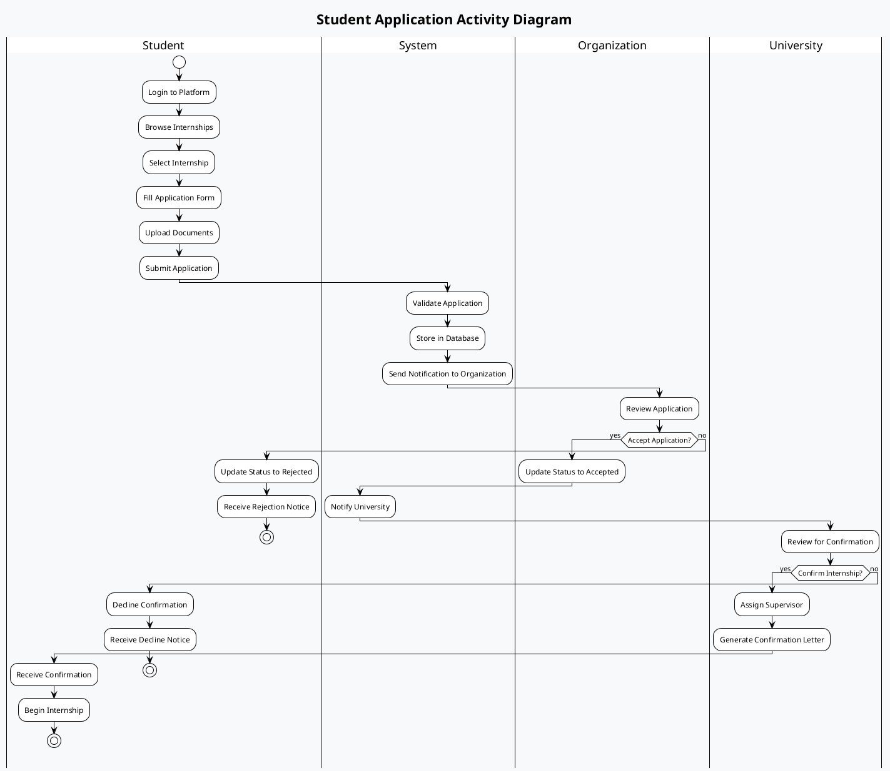

### e. Use Case Modeling

**System Use Cases:**

The Island Scholars platform supports a comprehensive set of use cases that address the needs of all stakeholders in the internship ecosystem. These use cases are organized by actor to clearly define the functionality available to each user type.

Students can register accounts to access the platform, manage their profiles with academic information and skills, browse available internships with filtering and search capabilities, apply for positions that match their interests and qualifications, and track their applications throughout the process. These use cases enable students to efficiently find and secure internship opportunities.

Organizations can register accounts to establish their presence on the platform, manage their company profiles with industry information and descriptions, post internship opportunities with detailed requirements, review applications from interested students, and select candidates based on qualifications and fit. These use cases enable organizations to efficiently recruit qualified interns.

Universities can register accounts to participate in the confirmation process, manage their institutional profiles, confirm internship applications from their students, assign academic supervisors to oversee student progress, and generate official documents for internship verification. These use cases enable universities to efficiently manage the academic aspects of internships.

Administrators can monitor the system for performance and issues, and generate reports on platform usage and outcomes. These use cases enable effective platform management and data-driven decision making.

This comprehensive set of use cases ensures that all stakeholder needs are addressed by the platform, creating a complete ecosystem for internship management that replaces previously manual and disconnected processes.


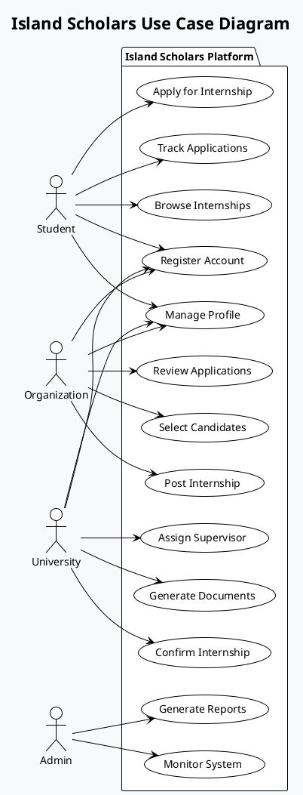

### f. Class Diagram

**Core System Classes:**

The Island Scholars platform's class diagram illustrates the object-oriented structure of the system, showing the key classes, their attributes, methods, and relationships. This design implements the conceptual model while adding implementation details necessary for development.

The User class serves as the foundation for authentication and authorization, with attributes for identity, credentials, and account status. It provides methods for registration, login, and profile management. This class implements the core user functionality shared across all user types.

The StudentProfile class extends User with academic information, including university affiliation, field of study, year of study, and skills. It provides methods for document upload and skill management. This class implements the student-specific functionality for internship applications.

The OrganizationProfile class extends User with company information, including name, industry, description, and contact details. It provides methods for updating company information and managing internship listings. This class implements the organization-specific functionality for opportunity posting.

The Internship class represents an internship opportunity, with attributes for description, requirements, location, and deadlines. It provides methods for creating, updating, and deactivating listings. This class implements the core internship management functionality.

The Application class connects students with internships, tracking status, documents, and timestamps. It provides methods for submission, status updates, and withdrawal. This class implements the application workflow at the heart of the platform.

The UniversityConfirmation class extends applications with university approval details, including supervisor assignment, dates, and academic requirements. It provides methods for confirmation, document generation, and supervisor management. This class implements the university confirmation process.

These classes and their relationships form the foundation of the system's implementation, providing a clear blueprint for development while maintaining alignment with the conceptual model and business requirements.


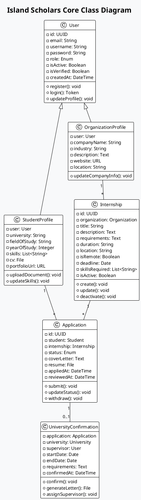

---

## 8. System Implementation Strategy

### Front-End Technology

**Frontend Architecture:**

The Island Scholars frontend architecture is designed for maintainability, performance, and user experience. It follows a component-based approach with clear separation of concerns and a unidirectional data flow pattern. The architecture consists of five main packages that work together to create a cohesive user interface.

The UI Components package contains all visual elements organized by function and reusability. Layout Components define the overall structure of the application, Page Components implement specific views, Feature Components provide reusable functionality, and Common Components are shared across the application. This hierarchical organization promotes reuse and consistency.

The State Management package handles data flow and component communication using React's Context API for global state, Custom Hooks for encapsulating stateful logic, and Local State for component-specific data. This approach avoids the complexity of external state management libraries while maintaining scalability.

The Routing package manages navigation using React Router for defining routes, Protected Routes for access control based on authentication and permissions, and Navigation Guards for preventing unauthorized access. This ensures users can only access appropriate sections of the application.

The API Integration package handles communication with the backend using Axios Client for HTTP requests, API Services for endpoint-specific logic, Request Interceptors for authentication and error handling, and Response Handlers for data transformation. This abstraction simplifies data fetching and error management.

The Utilities package provides common functionality including Form Validation for input checking, Date Formatting for consistent display, File Handling for document uploads, and Authentication for user identity management. These utilities reduce duplication and ensure consistent behavior.


```plantuml
@startuml Frontend Architecture
!theme plain
skinparam backgroundColor #f8f9fa

title Frontend Architecture (React + Bootstrap)

package "UI Components" {
  [Layout Components]
  [Page Components]
  [Feature Components]
  [Common Components]
}

package "State Management" {
  [Context API]
  [Custom Hooks]
  [Local State]
}

package "Routing" {
  [React Router]
  [Protected Routes]
  [Navigation Guards]
}

package "API Integration" {
  [Axios Client]
  [API Services]
  [Request Interceptors]
  [Response Handlers]
}

package "Utilities" {
  [Form Validation]
  [Date Formatting]
  [File Handling]
  [Authentication]
}

[UI Components] --> [State Management]
[UI Components] --> [Routing]
[State Management] --> [API Integration]
[API Integration] --> [Utilities]

@enduml
```

**Frontend Technology Stack:**
- **Framework**: React 18.x - Chosen for its component-based architecture, virtual DOM for performance, and extensive ecosystem
- **UI Library**: Bootstrap 5.x - Provides responsive design components, consistent styling, and accessibility features
- **Routing**: React Router 6.x - Handles client-side navigation with nested routes, route protection, and navigation guards
- **Animation**: Framer Motion - Creates fluid, physics-based animations and transitions for enhanced user experience
- **Icons**: React Icons - Offers a comprehensive library of popular icon sets with consistent API
- **HTTP Client**: Axios - Provides a promise-based API for HTTP requests with interceptors and error handling
- **Form Handling**: React Hook Form - Manages form state, validation, and submission with minimal re-renders
- **State Management**: Context API + Custom Hooks - Provides global state without external dependencies
- **Build Tool**: Vite - Offers fast development server and optimized production builds

### Back-End Technology

**Backend Architecture:**

The Island Scholars backend architecture follows a layered design that separates concerns, promotes maintainability, and enables scalability. The architecture consists of four main layers, each with specific responsibilities and interfaces to adjacent layers.

The API Layer serves as the interface to clients, handling HTTP requests and responses. It includes the Authentication API for user identity management, User API for profile operations, Internship API for opportunity management, Application API for internship applications, University API for confirmation processes, Document API for file operations, and Analytics API for reporting. This layer implements input validation, authentication, and response formatting.

The Service Layer contains the business logic of the application, implementing the core functionality and workflows. It includes the User Service for account management, Internship Service for opportunity processing, Application Service for application workflows, Notification Service for alerts and messages, Document Service for file generation, and Analytics Service for data analysis. This layer enforces business rules and orchestrates operations across multiple resources.

The Data Access Layer abstracts the interaction with data storage and external systems. It includes Models for database schema definition, Serializers for data transformation, Managers for custom query logic, and Querysets for database operations. This layer isolates the business logic from the specifics of data storage and retrieval.

The Infrastructure layer provides the technical foundation for the application. It includes Database Connectors for SQL operations, Cache Clients for performance optimization, File Storage for document management, and External APIs for third-party integrations. This layer handles the technical details of data persistence and external communication.

This layered architecture enables clear separation of concerns, making the codebase easier to understand, test, and maintain. It also facilitates scalability by allowing each layer to scale independently based on demand.


```plantuml
@startuml Backend Architecture
!theme plain
skinparam backgroundColor #f8f9fa

title Backend Architecture (Django + REST Framework)

package "API Layer" {
  [Authentication API]
  [User API]
  [Internship API]
  [Application API]
  [University API]
  [Document API]
  [Analytics API]
}

package "Service Layer" {
  [User Service]
  [Internship Service]
  [Application Service]
  [Notification Service]
  [Document Service]
  [Analytics Service]
}

package "Data Access Layer" {
  [Models]
  [Serializers]
  [Managers]
  [Querysets]
}

package "Infrastructure" {
  [Database Connectors]
  [Cache Clients]
  [File Storage]
  [External APIs]
}

[API Layer] --> [Service Layer]
[Service Layer] --> [Data Access Layer]
[Data Access Layer] --> [Infrastructure]

@enduml
```

**Backend Technology Stack:**
- **Framework**: Django 4.2.x - A high-level Python web framework that encourages rapid development and clean, pragmatic design
- **API**: Django REST Framework - A powerful and flexible toolkit for building Web APIs on top of Django
- **Database ORM**: Django ORM - Object-relational mapping for database interactions with migration support
- **Authentication**: JWT (JSON Web Tokens) - Stateless authentication mechanism for secure API access
- **Task Queue**: Celery - Distributed task queue for asynchronous processing and scheduled jobs
- **Caching**: Redis - In-memory data structure store used for caching and message brokering
- **File Storage**: AWS S3 / DigitalOcean Spaces - Cloud storage for user uploads and generated documents
- **Documentation**: Swagger / OpenAPI - API documentation and interactive testing interface
- **Testing**: pytest - Testing framework with fixtures, parameterization, and comprehensive assertions

### Database Engine

**Database Architecture:**

The Island Scholars platform employs a comprehensive database architecture that combines relational data storage, caching, and object storage to meet the diverse data management needs of the application. This architecture is designed for performance, scalability, and data integrity.

The Primary Database uses PostgreSQL, a powerful open-source relational database system with advanced features. It stores User Data including accounts and profiles, Application Data for internship applications and statuses, Internship Data for opportunity listings, Document Metadata for file references, and Analytics Data for reporting and insights. PostgreSQL was chosen for its robust transaction support, JSON capabilities, full-text search, and extensibility.

The Caching System uses Redis, an in-memory data structure store, to improve performance and reduce database load. It implements Session Cache for user authentication, Query Cache for frequently accessed data, Rate Limiting for API protection, and Notification Queue for asynchronous message processing. Redis provides high-speed operations, pub/sub messaging, and data structures like lists and sets that are ideal for these use cases.

The File Storage system uses cloud object storage to manage binary data outside the database. It stores Documents uploaded by users, Images for profiles and listings, Generated PDFs for official letters, and Backups for disaster recovery. This approach improves database performance by keeping binary data separate while providing scalable, durable storage for files.

The components interact through well-defined interfaces, with the PostgreSQL database sending cache invalidation messages to Redis when data changes, and storing file references that point to objects in the cloud storage. This separation of concerns allows each system to be optimized for its specific purpose while working together as a cohesive whole.


```plantuml
@startuml Database Architecture
!theme plain
skinparam backgroundColor #f8f9fa

title Database Architecture (PostgreSQL)

package "Primary Database" {
  database "PostgreSQL" {
    [User Data]
    [Application Data]
    [Internship Data]
    [Document Metadata]
    [Analytics Data]
  }
}

package "Caching System" {
  database "Redis" {
    [Session Cache]
    [Query Cache]
    [Rate Limiting]
    [Notification Queue]
  }
}

package "File Storage" {
  database "Object Storage" {
    [Documents]
    [Images]
    [Generated PDFs]
    [Backups]
  }
}

[PostgreSQL] --> [Redis] : Cache Invalidation
[PostgreSQL] --> [Object Storage] : File References

@enduml
```

**Database Technology Stack:**
- **Primary Database**: PostgreSQL 14.x - A powerful, open-source object-relational database system with over 30 years of active development
- **Database Features**:
  - JSONB for flexible data storage of skills, requirements, and other semi-structured data
  - Full-text search capabilities for internship and organization discovery
  - Row-level security for data isolation between organizations and universities
  - Transactional integrity to ensure data consistency across related operations
  - Robust indexing for performance optimization of common queries
  - Triggers and stored procedures for complex data operations
  - Replication for high availability and read scaling
- **Migration Management**: Django Migrations for version-controlled schema evolution
- **Backup Strategy**: Automated daily backups with point-in-time recovery capability

### DevOps Tools

**CI/CD Pipeline:**

The Island Scholars platform implements a comprehensive Continuous Integration and Continuous Deployment (CI/CD) pipeline that automates the process of building, testing, and deploying the application. This pipeline ensures consistent quality, reduces manual errors, and enables rapid, reliable delivery of new features.

The process begins when a Developer pushes code to the Git Repository, which triggers the CI/CD System to start the pipeline. The system first builds the application, compiling code and installing dependencies to create deployable artifacts.

Next, the system runs Unit Tests to verify individual components in isolation, ensuring that each part of the code functions correctly. If these tests pass, the system deploys the application to the Testing Environment for more comprehensive evaluation.

In the Testing Environment, the system runs Integration Tests to verify that components work together correctly, including API interactions and database operations. If these tests pass, the system deploys to the Staging Environment, which closely resembles production.

In the Staging Environment, the system runs End-to-End Tests that simulate real user interactions to verify complete workflows. If these tests pass, the system deploys to the Production Environment where the application serves real users.

After deployment to Production, the system performs Health Checks to verify that the application is functioning correctly in the live environment. These checks include API availability, database connectivity, and critical workflow validation.

This automated pipeline enables the development team to deliver changes quickly and confidently, with multiple validation stages ensuring that only high-quality code reaches production. The pipeline also provides visibility into the deployment process, with notifications at each stage and detailed logs for troubleshooting.


```plantuml
@startuml CI/CD Pipeline
!theme plain
skinparam backgroundColor #f8f9fa

title CI/CD Pipeline

actor Developer
participant "Git Repository" as Git
participant "CI/CD System" as CICD
participant "Testing Environment" as Test
participant "Staging Environment" as Staging
participant "Production Environment" as Prod

Developer -> Git : Push Code
Git -> CICD : Trigger Pipeline
CICD -> CICD : Build Application
CICD -> CICD : Run Unit Tests
CICD -> Test : Deploy to Test
Test -> CICD : Run Integration Tests
CICD -> Staging : Deploy to Staging
Staging -> CICD : Run E2E Tests
CICD -> Prod : Deploy to Production
Prod -> CICD : Health Checks

@enduml
```

**DevOps Technology Stack:**
- **Version Control**: Git (GitHub) - Distributed version control system for source code management
- **CI/CD**: GitHub Actions - Workflow automation integrated with GitHub repositories
- **Containerization**: Docker - Platform for developing, shipping, and running applications in containers
- **Orchestration**: Docker Compose - Tool for defining and running multi-container Docker applications
- **Infrastructure as Code**: Terraform - Tool for building, changing, and versioning infrastructure safely and efficiently
- **Monitoring**: Prometheus + Grafana - Time-series database and visualization platform for metrics
- **Logging**: ELK Stack (Elasticsearch, Logstash, Kibana) - Distributed search and analytics engine
- **Alerting**: PagerDuty / OpsGenie - Incident management platforms for real-time response

---

## 9. Testing and Quality Assurance

### Test Plan Overview

**Testing Strategy:**

The Island Scholars platform implements a comprehensive testing strategy that covers all aspects of the application from individual components to complete user journeys. This multi-layered approach ensures high quality, reliability, and performance while enabling rapid development and deployment.

The Unit Testing layer forms the foundation, with Component Tests for UI elements, Service Tests for business logic, Model Tests for data operations, and Utility Tests for helper functions. These tests verify that individual parts of the system function correctly in isolation, providing fast feedback during development and preventing regression issues.

The Integration Testing layer builds on this foundation, with API Tests for endpoint functionality, Service Integration tests for interactions between services, Database Operations tests for data persistence, and External Services tests for third-party integrations. These tests verify that components work together correctly, catching issues that might not appear in unit tests.

The System Testing layer provides broader validation, with End-to-End Tests for complete user journeys, Performance Tests for response time and throughput, Security Tests for vulnerability detection, and Usability Tests for user experience evaluation. These tests verify that the complete system meets requirements and performs well under realistic conditions.

The Acceptance Testing layer ensures business validation, with User Acceptance tests involving actual users, Stakeholder Review for business alignment, Business Validation for process verification, and Compliance Check for regulatory requirements. These tests verify that the system delivers the expected business value.

This comprehensive strategy shifts testing left in the development process, finding issues earlier when they are less expensive to fix. It also provides confidence for continuous deployment by ensuring that changes meet quality standards before reaching production.


```plantuml
@startuml Testing Strategy
!theme plain
skinparam backgroundColor #f8f9fa

title Testing Strategy

package "Unit Testing" {
  [Component Tests]
  [Service Tests]
  [Model Tests]
  [Utility Tests]
}

package "Integration Testing" {
  [API Tests]
  [Service Integration]
  [Database Operations]
  [External Services]
}

package "System Testing" {
  [End-to-End Tests]
  [Performance Tests]
  [Security Tests]
  [Usability Tests]
}

package "Acceptance Testing" {
  [User Acceptance]
  [Stakeholder Review]
  [Business Validation]
  [Compliance Check]
}

[Unit Testing] --> [Integration Testing]
[Integration Testing] --> [System Testing]
[System Testing] --> [Acceptance Testing]

@enduml
```

### Unit / Integration / System Testing

**Testing Pyramid:**

The Island Scholars testing strategy follows the Testing Pyramid model, which advocates for a larger number of fast, focused tests at the lower levels and fewer, more comprehensive tests at the higher levels. This approach balances thoroughness with execution speed and maintenance cost.

At the base of the pyramid are Unit Tests, which are numerous, cheap to create and run, and provide fast feedback. These tests focus on individual functions, methods, and components in isolation, using mocks or stubs for dependencies. The platform aims for 80%+ code coverage at this level, with thousands of unit tests running in seconds.

In the middle of the pyramid are Integration Tests, which verify that components work together correctly. These tests are more expensive to create and run than unit tests but provide valuable validation of component interactions. The platform includes hundreds of integration tests covering API endpoints, service interactions, and database operations.

Near the top of the pyramid are End-to-End Tests, which validate complete user journeys from UI interaction to database changes. These tests are expensive to create, run slowly, and can be brittle, but they provide crucial validation of the system as a whole. The platform includes dozens of E2E tests covering critical user flows.

At the top of the pyramid are Manual Tests, which are few in number but provide valuable human judgment for aspects like usability, visual design, and exploratory testing. These tests are expensive and cannot be automated but catch issues that automated tests might miss.

This balanced approach ensures comprehensive test coverage while maintaining reasonable execution times and maintenance costs. The majority of issues are caught by the fast, numerous lower-level tests, while the more expensive higher-level tests validate complete system behavior.


```plantuml
@startuml Testing Pyramid
!theme plain
skinparam backgroundColor #f8f9fa

title Testing Pyramid

rectangle "Manual Tests" as MT #FFC0CB
rectangle "End-to-End Tests" as E2E #FFD700
rectangle "Integration Tests" as IT #90EE90
rectangle "Unit Tests" as UT #ADD8E6

MT -[hidden]-> E2E
E2E -[hidden]-> IT
IT -[hidden]-> UT

note right of MT
  Few, expensive, slow
end note

note right of UT
  Many, cheap, fast
end note

@enduml
```

**Testing Approach:**

1. **Unit Testing**
   - Frontend: Jest + React Testing Library for component testing
   - Backend: pytest for Python code testing
   - Coverage target: 80%+ for both frontend and backend
   - Automated in CI pipeline with each commit
   - Focus areas: Component rendering, business logic, utility functions, model methods
   - Mocking strategy: Mock external dependencies and services
   - Execution frequency: On every commit and pull request

2. **Integration Testing**
   - API testing with Postman/Newman for endpoint validation
   - Service integration tests for business logic coordination
   - Database operation tests for data persistence and retrieval
   - Mock external dependencies for isolation and reliability
   - Focus areas: API contracts, service interactions, database transactions
   - Data strategy: Test-specific database with seeded test data
   - Execution frequency: On every pull request and nightly builds

3. **System Testing**
   - End-to-end testing with Cypress for user journey validation
   - Performance testing with JMeter for load and stress testing
   - Security testing with OWASP ZAP for vulnerability scanning
   - Cross-browser compatibility testing across major browsers
   - Focus areas: Complete user workflows, system performance, security vulnerabilities
   - Environment strategy: Dedicated testing environment resembling production
   - Execution frequency: Before each production deployment and weekly scheduled runs

4. **User Acceptance Testing**
   - Stakeholder validation with business representatives
   - Real-world scenario testing with actual users
   - Usability feedback collection through guided sessions
   - Beta testing program with selected early adopters
   - Focus areas: Business process validation, usability, real-world scenarios
   - Feedback mechanism: Structured forms and observation sessions
   - Execution frequency: Before major releases and feature launches

### Acceptance Criteria

**Sample Acceptance Criteria:**

1. **User Registration**
   - Users can register with email and password through a secure form
   - Email verification is required before account activation
   - Different registration flows for each role collect appropriate information
   - Profile completion guidance provided with progress indicators
   - Password strength requirements enforced with visual feedback
   - Duplicate email detection prevents multiple accounts
   - Terms of service acceptance is required
   - Account creation confirmation is sent via email

2. **Internship Application**
   - Students can search and filter internships by location, industry, duration, etc.
   - Application form includes all required fields with validation
   - Document upload supports required formats (PDF, DOC, DOCX) with size limits
   - Confirmation email sent after submission with application reference number
   - Students can save draft applications before submission
   - Application history is visible in student dashboard
   - Students cannot apply to the same internship multiple times
   - Application deadline enforcement prevents late submissions

3. **University Confirmation**
   - Universities can view pending applications from their students
   - Confirmation process includes supervisor assignment from faculty list
   - Official letters generated in PDF format with university letterhead
   - All parties notified of confirmation status via email and in-app notifications
   - Confirmation includes academic requirements and learning objectives
   - Digital signature or approval workflow for authorized personnel
   - Confirmation letter includes internship details, dates, and supervisor contact
   - Audit trail of confirmation process maintained for compliance

4. **System Performance**
   - Page load time < 2 seconds for all main pages on standard connections
   - Search results returned in < 1 second for typical queries
   - File uploads complete in < 5 seconds for documents under 5MB
   - System handles 1,000+ concurrent users with < 10% performance degradation
   - API response time < 500ms for 95% of requests
   - Database queries complete in < 100ms for common operations
   - Mobile responsiveness with usable interface on devices down to 320px width
   - Graceful degradation under poor network conditions

---

## 10. Deliverables

### Software Application

**Application Components:**

1. **Web Application**
   - Responsive frontend for all devices from mobile phones to desktop computers
   - Role-based user interfaces tailored to students, organizations, universities, and administrators
   - Progressive web app capabilities with offline access to key features
   - Offline functionality for key features like application drafts and document viewing
   - Optimized performance for varying network conditions common in Tanzania
   - Accessibility features compliant with WCAG 2.1 AA standards
   - Multi-language support for English and Swahili
   - Cross-browser compatibility with Chrome, Firefox, Safari, and Edge

2. **Backend API**
   - RESTful API endpoints following OpenAPI specification
   - Authentication and authorization with JWT tokens and role-based permissions
   - Business logic implementation for all core processes
   - External service integrations for email, SMS, and file storage
   - Comprehensive error handling and logging
   - Rate limiting and security protections
   - Versioning strategy for API evolution
   - Comprehensive documentation with Swagger/OpenAPI

3. **Database System**
   - Optimized schema design for performance and data integrity
   - Data migration scripts for version control and deployment
   - Backup and recovery procedures with point-in-time recovery
   - Performance monitoring and query optimization
   - Data validation and integrity constraints
   - Indexing strategy for common query patterns
   - Audit logging for sensitive operations
   - Data retention policies compliant with regulations

4. **Infrastructure**
   - Production environment setup with high availability
   - Staging environment for testing that mirrors production
   - CI/CD pipeline configuration for automated deployment
   - Monitoring and alerting system for operational visibility
   - Scaling configuration for handling load variations
   - Security hardening and compliance measures
   - Backup and disaster recovery procedures
   - Performance optimization configurations

### Technical Documentation

**Documentation Deliverables:**

1. **Architecture Documentation**
   - System architecture diagrams with detailed component descriptions
   - Component interaction specifications defining interfaces and dependencies
   - Technology stack details with version requirements and compatibility notes
   - Security architecture with threat models and mitigation strategies
   - Scalability considerations and growth planning
   - Performance optimization guidelines
   - Technical decision records explaining key architectural choices
   - Infrastructure topology and network design

2. **API Documentation**
   - Endpoint specifications with URL patterns, HTTP methods, and status codes
   - Request/response formats with JSON schema definitions
   - Authentication requirements and token handling
   - Usage examples for common operations
   - Error handling and response codes
   - Rate limiting and pagination information
   - Versioning strategy and backward compatibility notes
   - Integration guidelines for third-party developers

3. **Database Documentation**
   - Schema diagrams with entity relationships
   - Table definitions with column descriptions and constraints
   - Indexing strategy for performance optimization
   - Query optimization guidelines for common operations
   - Data migration procedures for schema evolution
   - Backup and recovery procedures
   - Data dictionary with business definitions
   - Performance monitoring and tuning guidelines

4. **Deployment Documentation**
   - Environment setup instructions for development, staging, and production
   - Configuration parameters with default values and customization options
   - Scaling guidelines for handling increased load
   - Backup procedures for data protection
   - Monitoring setup for operational visibility
   - Security hardening recommendations
   - Troubleshooting guides for common issues
   - Disaster recovery procedures

### User Guide or Manual

**User Documentation:**

1. **Student User Guide**
   - Account setup and profile management with step-by-step instructions
   - Internship search and application with screenshots and examples
   - Document management for resumes, cover letters, and university letters
   - Application tracking with status explanations
   - Notification settings and communication preferences
   - Mobile app usage guidelines
   - Frequently asked questions and troubleshooting
   - Best practices for successful applications

2. **Organization User Guide**
   - Company profile setup with branding and information guidelines
   - Internship posting workflow with field explanations
   - Application review process with filtering and sorting options
   - Candidate selection and management best practices
   - Communication tools for applicant interaction
   - Analytics and reporting features
   - Account management and user permissions
   - Integration with university confirmation process

3. **University User Guide**
   - Account verification and institutional profile setup
   - Student application review process with approval workflows
   - Supervisor assignment and management
   - Document generation for official letters
   - Progress monitoring for active internships
   - Reporting and analytics for student placements
   - Academic requirement management
   - Integration with academic records (if applicable)

4. **Administrator Manual**
   - System configuration options and settings
   - User management including verification and moderation
   - Content moderation procedures and guidelines
   - Analytics and reporting capabilities
   - System monitoring and performance tools
   - Security management and audit procedures
   - Backup and recovery operations
   - Troubleshooting common system issues

### Training Materials

**Training Resources:**

1. **Video Tutorials**
   - Role-specific walkthroughs for students, organizations, and universities
   - Feature demonstrations showing key functionality in action
   - Common workflows from start to finish
   - Troubleshooting guides for frequent issues
   - Mobile app usage tutorials
   - Advanced feature explanations
   - Administrator training for system management
   - Best practices for optimal platform use

2. **Interactive Guides**
   - Step-by-step walkthroughs with in-app guidance
   - Feature discovery tours highlighting new functionality
   - Contextual help content based on user location in the app
   - FAQ resources with searchable knowledge base
   - Interactive tutorials for complex processes
   - Tooltips and hints for UI elements
   - Guided setup wizards for new users
   - Interactive examples with sample data

3. **Workshop Materials**
   - Training session slides for in-person or virtual sessions
   - Hands-on exercises with practice scenarios
   - Assessment quizzes to verify understanding
   - Reference materials for key concepts
   - Facilitator guides for trainers
   - Group activities for collaborative learning
   - Case studies demonstrating real-world usage
   - Certification materials for power users

4. **Knowledge Base**
   - Searchable documentation organized by topic and user role
   - Best practices for each user type
   - Common issues and solutions with troubleshooting steps
   - Feature updates and changes with version history
   - Glossary of terms and concepts
   - System limitations and workarounds
   - Integration guidelines for related systems
   - Community forums for user discussion and support

### Deployment Scripts

**Deployment Resources:**

1. **Infrastructure as Code**
   - Terraform scripts for cloud resources including compute, storage, and networking
   - Docker compose configurations for containerized deployment
   - Environment variable templates for configuration management
   - Network configuration for security groups and access control
   - Load balancer setup for high availability
   - Database cluster configuration
   - Monitoring and logging infrastructure
   - Scaling policies for auto-scaling groups

2. **Database Scripts**
   - Schema creation scripts for initial database setup
   - Initial data seeding for reference data and test accounts
   - Migration procedures for version upgrades
   - Backup and restore scripts for data protection
   - Performance optimization scripts for indexes and query plans
   - Data archiving procedures for historical data
   - Integrity check scripts for data validation
   - User and permission management scripts

3. **CI/CD Configuration**
   - GitHub Actions workflows for automated testing and deployment
   - Build and test automation scripts
   - Deployment procedures for staging and production
   - Rollback mechanisms for failed deployments
   - Environment-specific configuration management
   - Artifact storage and versioning
   - Notification setup for deployment events
   - Security scanning integration

4. **Monitoring Setup**
   - Prometheus configuration for metrics collection
   - Grafana dashboards for visualization and alerting
   - Log aggregation setup with ELK stack
   - Alert configuration for critical system conditions
   - Performance monitoring for application and database
   - User experience monitoring
   - Security monitoring for suspicious activities
   - Health check endpoints and monitoring

---

## 11. Maintenance and Sustainability Plan

### Ongoing Support

**Support Structure:**

The Island Scholars platform implements a comprehensive support structure to ensure reliable operation, timely issue resolution, and continuous improvement. This multi-tiered approach provides appropriate assistance for different types of issues while optimizing resource utilization.

Tier 1 Support serves as the first point of contact for users, handling common questions and issues through the User Help Desk staffed by support specialists, Documentation with comprehensive guides and tutorials, FAQ System with answers to common questions, and Chatbot Support for immediate assistance with simple issues. This tier resolves approximately 70% of support requests without escalation.

Tier 2 Support handles more complex issues that require technical expertise, including Technical Support for application-specific problems, Bug Investigation to reproduce and document defects, Feature Clarification to explain system capabilities, and Data Issues requiring database access. This tier has deeper system knowledge and limited administrative capabilities.

Tier 3 Support consists of specialized experts who handle the most complex issues, including the Development Team for code-level problems, Database Specialists for data integrity and performance issues, Security Experts for vulnerability assessment and remediation, and System Architects for architectural concerns. This tier has full system access and development capabilities.

Proactive Maintenance works alongside the reactive support tiers to prevent issues before they occur, including Monitoring for early problem detection, Performance Optimization to maintain system responsiveness, Security Updates to address vulnerabilities, and Capacity Planning to ensure adequate resources. This proactive approach reduces the overall support burden and improves system reliability.


```plantuml
@startuml Support Structure
!theme plain
skinparam backgroundColor #f8f9fa

title Support and Maintenance Structure

package "Tier 1 Support" {
  [User Help Desk]
  [Documentation]
  [FAQ System]
  [Chatbot Support]
}

package "Tier 2 Support" {
  [Technical Support]
  [Bug Investigation]
  [Feature Clarification]
  [Data Issues]
}

package "Tier 3 Support" {
  [Development Team]
  [Database Specialists]
  [Security Experts]
  [System Architects]
}

package "Proactive Maintenance" {
  [Monitoring]
  [Performance Optimization]
  [Security Updates]
  [Capacity Planning]
}

[Tier 1 Support] --> [Tier 2 Support] : Escalation
[Tier 2 Support] --> [Tier 3 Support] : Escalation
[Proactive Maintenance] --> [Tier 3 Support] : Coordination

@enduml
```

**Support Levels:**
- **Tier 1**: Basic user support, common issues, documentation - Resolves 70% of issues with 24-hour response time
- **Tier 2**: Technical troubleshooting, bug verification, data issues - Resolves 25% of issues with 12-hour response time
- **Tier 3**: Complex problem resolution, code fixes, system optimization - Resolves 5% of issues with 4-hour response time for critical issues

### Feedback Loop

**Feedback Process:**

The Island Scholars platform implements a structured feedback process to continuously improve the system based on user experiences and needs. This process ensures that user input is systematically collected, evaluated, and incorporated into the platform's evolution.

The process begins when a User submits feedback through one of multiple channels, including in-app forms, email, support tickets, or user interviews. This feedback is routed to the Feedback System, which logs the input and performs initial categorization based on content analysis.

The Support Team then receives the feedback, further categorizes it by type and priority, and routes it appropriately based on the nature of the input. The routing follows three main paths depending on whether the feedback is a bug report, feature request, or general feedback.

For bug reports, the Support Team creates an issue in the tracking system and assigns it to the Development Team, who investigates the problem, develops a fix, and returns the resolution to Support. Support then notifies the user about the fix and its availability.

For feature requests, the Support Team submits the idea to the Product Team, who evaluates its alignment with the product roadmap, prioritizes it among other requests, and potentially adds it to the development backlog. The Product Team then notifies the user about the decision and timeline.

For general feedback, the Support Team shares insights with the Product Team, who analyzes patterns across multiple feedback items, develops an action plan for improvements, and the Support Team thanks the user for their input.

This comprehensive process ensures that all feedback is acknowledged, evaluated, and incorporated into the platform's improvement cycle, creating a continuous loop of enhancement based on real user experiences.


```plantuml
@startuml Feedback Process
!theme plain
skinparam backgroundColor #f8f9fa

title User Feedback Process

actor User
participant "Feedback System" as FS
participant "Support Team" as ST
participant "Product Team" as PT
participant "Development Team" as DT

User -> FS : Submit Feedback
FS -> ST : Route Feedback
ST -> ST : Categorize & Prioritize

alt Bug Report
  ST -> DT : Create Issue
  DT -> DT : Investigate & Fix
  DT -> ST : Resolution
  ST -> User : Notify User
else Feature Request
  ST -> PT : Submit Request
  PT -> PT : Evaluate & Prioritize
  PT -> DT : Add to Roadmap
  PT -> User : Notify User
else General Feedback
  ST -> PT : Share Insights
  PT -> PT : Analyze Patterns
  PT -> ST : Action Plan
  ST -> User : Thank User
end

@enduml
```

**Feedback Channels:**
- In-app feedback forms integrated at key points in the user journey
- User surveys and interviews conducted quarterly with representative samples
- Support ticket analysis to identify common issues and improvement opportunities
- Usage analytics to identify pain points and optimization opportunities
- Social media monitoring for public sentiment and suggestions
- Beta testing program for early feature validation with power users
- Focus groups for in-depth exploration of specific features or workflows
- Advisory board of key stakeholders for strategic direction

### System Update Policy

**Update Process:**

The Island Scholars platform follows a structured update process that balances the need for continuous improvement with system stability and user experience. This process ensures that changes are properly developed, tested, and deployed with minimal disruption.

The process begins with identifying an update need, which may be a bug fix, feature enhancement, or security patch. The nature of the update determines its initial prioritization, with security updates receiving the highest priority, followed by bug fixes and feature updates according to their business impact.

Once prioritized, the development team implements the changes following coding standards and best practices. The changes then undergo testing in the development environment, including unit tests, integration tests, and manual verification as appropriate for the change scope.

After passing development testing, the changes are deployed to the staging environment, which mirrors production. Here, Quality Assurance performs comprehensive testing including regression testing, performance impact assessment, and security validation.

If the tests pass, the deployment process continues with scheduling the production deployment, notifying stakeholders about the upcoming changes, creating detailed release notes, deploying to production using automated procedures, and monitoring post-deployment to ensure system stability.

If tests fail at any stage, the changes return to development for issue resolution, and the process repeats until all tests pass. This iterative approach ensures that only high-quality changes reach production.

This structured process applies to all types of updates, with the timeline and testing depth adjusted based on the update's scope and risk. The process ensures that the platform evolves continuously while maintaining reliability and performance.


```plantuml
@startuml Update Process
!theme plain
skinparam backgroundColor #f8f9fa

title System Update Process

start
:Identify Update Need;
note right: Bug fix, feature, or enhancement

fork
  :Security Update;
  :Prioritize as Critical;
fork again
  :Feature Update;
  :Prioritize by Roadmap;
fork again
  :Bug Fix;
  :Prioritize by Impact;
end fork

:Develop Changes;
:Test in Development;
:Deploy to Staging;
:Perform QA Testing;

if (Tests Pass?) then (yes)
  :Schedule Production Deployment;
  :Notify Stakeholders;
  :Create Release Notes;
  :Deploy to Production;
  :Monitor Post-Deployment;
else (no)
  :Return to Development;
  :Address Issues;
  goto Develop Changes;
endif

stop

@enduml
```

**Update Types:**
- **Critical Updates**: Security patches, critical bug fixes (24-48 hour deployment)
  - Highest priority with expedited testing and approval
  - May be deployed outside regular release schedule
  - Focused testing on the specific issue and regression prevention
  - Immediate notification to all users if service impact

- **Maintenance Updates**: Non-critical bug fixes, minor enhancements (bi-weekly)
  - Regular cadence with standard testing procedures
  - Bundled together for efficiency
  - Comprehensive regression testing
  - Advance notification to users through in-app announcements

- **Feature Updates**: New functionality, major enhancements (monthly)
  - Planned according to product roadmap
  - Full testing cycle including user acceptance testing
  - Comprehensive documentation and training materials
  - Marketing communications and user onboarding

- **Major Releases**: Significant platform changes (quarterly)
  - Extensive planning and development cycles
  - Beta testing with selected users before general release
  - Comprehensive training and documentation updates
  - Phased rollout strategy to manage risk
  - Detailed migration plans if data structure changes

---

## 12. Appendices

### Glossary of Terms

| Term | Definition |
|------|------------|
| **Internship** | A temporary position offering practical experience to students, typically lasting 1-6 months and often required for academic credit |
| **Placement** | The successful matching of a student with an organization for an internship position |
| **Confirmation Letter** | Official university document approving an internship and confirming academic credit eligibility |
| **Academic Supervisor** | University staff member overseeing student internships, providing guidance and evaluation |
| **Industry Mentor** | Organization staff member guiding intern development and providing practical training |
| **Field Attachment** | Alternative term for internship used in Tanzania, particularly in technical and vocational education |
| **Stipend** | Financial compensation provided to interns, typically covering basic expenses rather than full salary |
| **Mandatory Internship** | Required practical experience for degree completion, typically with specific duration and documentation requirements |
| **Application Status** | The current state of an internship application (pending, under review, accepted, rejected, withdrawn) |
| **University Verification** | Process by which a university confirms a student's eligibility for an internship |
| **Skills Matrix** | Structured representation of a student's capabilities used for matching with internship requirements |
| **Internship Cycle** | The complete process from opportunity posting through application, selection, and completion |

### Acronyms

| Acronym | Full Form |
|---------|-----------|
| **API** | Application Programming Interface - Set of rules allowing software components to communicate |
| **JWT** | JSON Web Token - Compact, URL-safe means of representing claims securely between parties |
| **KPI** | Key Performance Indicator - Measurable value demonstrating effectiveness in achieving objectives |
| **SRS** | Software Requirements Specification - Document describing functional and non-functional requirements |
| **SDD** | Software Design Document - Detailed description of system architecture and components |
| **UI/UX** | User Interface/User Experience - Visual elements and interaction design of software |
| **CI/CD** | Continuous Integration/Continuous Deployment - Automated software delivery process |
| **MVP** | Minimum Viable Product - Version with just enough features to satisfy early users |
| **ORM** | Object-Relational Mapping - Technique for converting data between incompatible type systems |
| **REST** | Representational State Transfer - Architectural style for distributed hypermedia systems |
| **TCU** | Tanzania Commission for Universities - Regulatory body for higher education in Tanzania |
| **NACTE** | National Council for Technical Education - Regulatory body for technical education in Tanzania |
| **HESLB** | Higher Education Students' Loans Board - Government agency providing student loans in Tanzania |
| **WCAG** | Web Content Accessibility Guidelines - Recommendations for making web content accessible |

### References

1. Tanzania Commission for Universities (TCU) - Internship Guidelines for Higher Education Institutions (2023)
2. Ministry of Education and Vocational Training - Field Attachment Requirements for Degree Programs (2022)
3. Higher Education Students' Loans Board (HESLB) - Student Support Guidelines for Internship Periods (2023)
4. Tanzania Employment Services Agency - Internship Standards and Best Practices (2022)
5. International Labour Organization - Internship Best Practices for Developing Countries (2021)
6. World Bank - Digital Skills for Youth Employment in Sub-Saharan Africa Report (2022)
7. African Development Bank - Education and Skills Development Reports for East Africa (2023)
8. IEEE Software Engineering Standards - IEEE 830 (Requirements Specification) and IEEE 1016 (Software Design Description)
9. OWASP Security Guidelines - Web Application Security Best Practices (2023)
10. Web Content Accessibility Guidelines (WCAG) 2.1 - W3C Recommendation for Web Accessibility
11. Django Documentation - Best Practices for Scalable Web Applications (2023)
12. React Documentation - Component Design Patterns and Performance Optimization (2023)
13. PostgreSQL Documentation - Database Design and Optimization Guidelines (2023)
14. Tanzania Digital Economy Report - Ministry of Information and Communications Technology (2022)
15. Higher Education Statistics - Tanzania National Bureau of Statistics (2023)